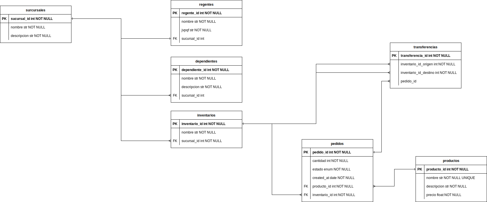

# DermaCenter2
Dermacenter practice part 2

**Requisitos:**

-Instalar python (https://www.python.org/downloads/)

-Instalar postgresSQL (https://www.postgresql.org/download/)

-Instalar Docker (https://docs.docker.com/get-docker/)

**Correr localmente:**

-Crear archivo .env

-Crear copia .env.example

-Configurar entorno:

https://packaging.python.org/en/latest/guides/installing-using-pip-and-virtual-environments/  
python -m pip install --user virtualenv  
python -m venv env  

.\env\Scripts\activate  
source env/Scripts/Activate  

**Correr con docker-compose:**

-Ejecutar: docker-compose up --build

**Documentacion:**

http://localhost/docs  
Postman:  
./Farmacia parte 2.postman_collection.json

**ERD:**
      

    
